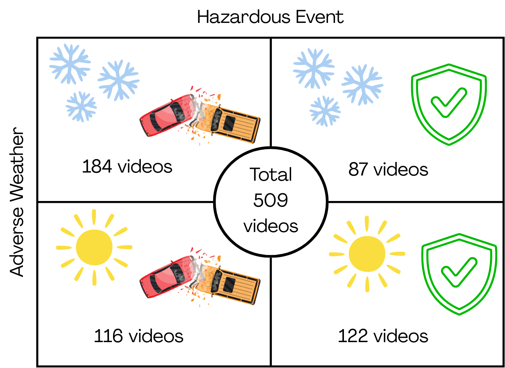

# Autonomous-Winter-Driving-Benchmark-AWDB-
This repo contains the dataset for the paper 'Benchmarking Vision-Language Models for Traffic Scene Understanding in Inclement Winter Weather: The AWDB Benchmark' published in WACV, 2026.

 Fig.1 Video distribution of the AWDB benchmark by weather conditions and hazardous events.

Dataset link that contains vidoes, human captions, and LLM captions:
https://drive.google.com/drive/folders/156baQZgNPoveU0J7pbpjWLbo8R-5NJtl?usp=drive_link

Please cite this work:

